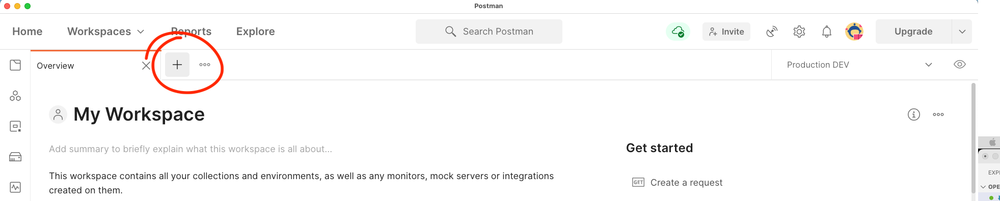
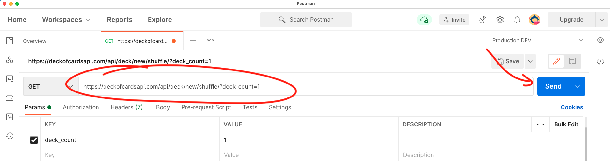
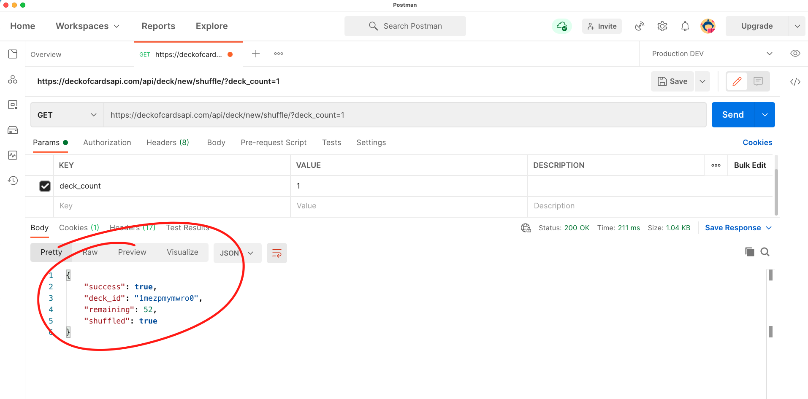
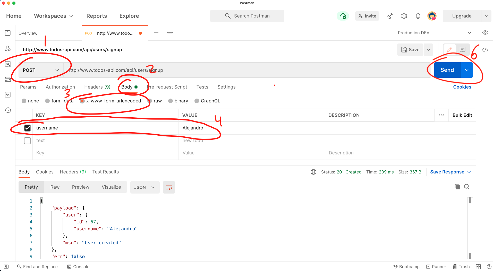

# Session 3

### Objective

Put it all together to build a REST API with Express.js

## What is an API

**A**pplication **P**rogramming **I**interface. 

Let's start with the most important part of an API, the I part, I for Interface


Interfaces are crated for two systems to interact and "talk" to each other. You might not think too much about it but you are a human system interacting with a computer system right now. You interact with the computer via a Graphical User Application (GUI) that engineers created to enable us to be communicate with and control the computer. Where a GUI connects a user and a computer and API connects two applications.

At this point we have code to retrieve and add information to our Database, but so far this functionality is only available to us the developers of this back-end. No external application can interact with our data or functionality, and data is not very useful in a silo. To expose the functionality of adding business, listing all business or updating business to external applications we will build an API in this session. This API will be accessed through HTTP on the web and any application that wants to connect to it to access its services would be able to do so.

APIs exist, so that two or more applications can communicate with each other


## Example of APIs

* [Deck of Cards API](https://deckofcardsapi.com/). An API to simulate a deck of cards. You can create decks, shuffle the deck, draw cards and add cards to piles.
* [Todos API](https://github.com/alejo4373/Todos-API). A simple API for a To-dos application. Let's you create, update, delete and retrieve todos.
* [Yelp API](https://www.yelp.com/developers/documentation/v3). Find businesses by keyword, location
* [YouTube API](https://developers.google.com/youtube/v3). Let's you search for videos, upload videos, manage playlists and subscriptions and more
* [GitHub API](https://docs.github.com/en/rest). Create repos, open/close pull requests or issues. Almost everything you can do on Github.com you can do by calling their API.
* [Dropbox API](https://www.dropbox.com/developers/documentation/http/documentation). Let's work with files in Dropbox, upload, download, search and modify files.
* [Commerce.js API](https://commercejs.com/docs/api/?shell#introduction). Back-end for an eCommerce site, so you don't have to build your own. Create, list, update and delete online store items.

All APIs expect the Deck of Cards API and the Todos API require some ways of authentication via tokens.

Before we can interact with APIs we need to understand their ways of communication. The previous API examples and the API we will build will communicate via HTTP messages (requests & responses) which are define by the HTTP protocol.

### HTTP

Hypertext Transfer Protocol (HTTP) is an application-layer protocol for transmitting hypermedia documents, such as HTML. It was designed for communication between web browsers and web servers, but it can also be used for other purposes. HTTP follows a classical client-server model, with a client opening a connection to make a request, then waiting until it receives a response. HTTP is a stateless protocol, meaning that the server does not keep any data (state) between two requests. [


#### HTTP Messages

HTTP messages are how data is exchanged between a server and a client. There are two types of messages: requests sent by the client to trigger an action on the server, and responses, the answer from the server.

HTTP messages are composed of textual information encoded in ASCII, and span over multiple lines. These messages are rarely crafted by hand, instead the web browser or web servers perform this action.

This is what these messages look like


##### HTTP Methods

HTTP defines various methods to be used in requests messages for the server to perform. Some are:

| Method Name | Description                                                                                                       | Our use case                                   |
| ----------- | ----------------------------------------------------------------------------------------------------------------- | ---------------------------------------------- |
| `GET`       | Requests a representation of the specified resource. Requests using GET should only retrieve data.                | Retrieving all businesses or a single business |
| `POST`      | Used to submit an entity to the specified resource, often causing a change in state or side effects on the server | Adding a new business                          |
| `DELETE`    | Used to delete the specified resource                                                                             | Deleting a business                            |
| `PUT`       | Replaces all current representations of the target resource with the request payload.                             | Fully updating/replacing a business            |
| `PATCH`     | Used to apply partial modifications to a resource.                                                                | Partially updating a business                  |

[Learn more](https://developer.mozilla.org/en-US/docs/Web/HTTP/Methods)

##### HTTP Status Codes

HTTP response status codes indicate whether a specific HTTP request has been successfully completed. Status codes are divided into 5 categories, below them I listed some of the most common per category:

* 1xx informational response – the request was received, continuing process
* 2xx successful – the request was successfully received, understood, and accepted
  * `200 OK` The request has succeeded
  * `201 Created` The requests has succeeded and a new resource has been created as a result
* 3xx redirection – further action needs to be taken in order to complete the request
  * `301 Moved Permanently` The URL of the requested resource has been changed permanently. The new URL is given in the response.
* 4xx client error – the request contains bad syntax or cannot be fulfilled
  * `400 Bad Request`
  * `403 Forbidden`
  * `404 Not Found`
* 5xx server error – the server failed to fulfil an apparently valid request
  * `500 Internal Server Error` The server has encountered a situation it doesn't know how to handle.

To [learn more](https://developer.mozilla.org/en-US/docs/Web/HTTP/Status)

## Postman

To test APIs, and to send and inspect HTTP requests and responses we will use the Postman API client


To download Postman visit https://www.postman.com/downloads/

To install Postman simply execute the downloaded installers

## Consuming APIs

To consume an API a client sends HTTP requests to specific endpoint/urls of the API. Let's try the Deck of Cards API

Open up Postman and create a new request by opening a new tab



Then paste the url for the Deck of Cards API `https://deckofcardsapi.com/api/deck/new/shuffle/?deck_count=1` in the address bar and hit **Send**



The response should appear in the bottom half of the Postman window with the result of our request



The Deck of cards doesn't accept POST requests. To try a post request lets use the Todos API. `http://www.todos-api.com/api/users/signup`. 

Change the method to be POST, select Body, then select `x-www-form-urlencoded` and add a `username` field/key with a value, then hit Send. Take a look at the screenshot below.



**Exercise**. Look at the Todos API documentation to learn what resources and endpoints exist, then and try a few other requests. Remember to try the different HTTP methods and be attentive of what status code the API returns.

## Building our API with Express.js

1. Open the folder `backend-bootcamp` we created in the previous session with VSCode.
2. Insider the folder `backend-bootcamp` create a new folder and call it `db`, then move the files we created in the previous session (`Businness.js` & `Users.js`) to it. This directory will be reserved to contain the code that interacts with our database using `pg-promise`.
3. Create a new file and call it `server.js`. This file will contain our JavaScript code for our Express.js server
4. Install `express` by opening the VSCode terminal and typing `npm install express`
5. Open `server.js` with VSCode and add the JS code below

```js
const express = require('express')      // Import express
const server = express()                // Create an Express server
const PORT = process.env.PORT || '3000' // Read the port from the environment or use port 3000

server.get('/', (req, res, next) => {  // Listen for a `get` request at the root endpoint
  res.send('Hello World')              // Send the text "Hello World" in the response
})

server.listen(PORT, () => {            // Listen for requests coming through port PORT
  console.log(`server listening on http://localhost:${PORT}`)
})
```

### Route setup 

### `GET /businesses` Route
### `GET /businesses/:id` Route
### `POST /businesses` Route
### `PUT /businesses/:id` Route
### `DELETE /businesses/:id` Route


dotenv .env


### Resources

* [Web technology for developers > HTTP - MDN](https://developer.mozilla.org/en-US/docs/Web/HTTP)
* [The Internet Protocol Suit - Khan Academy](https://www.khanacademy.org/computing/computers-and-internet/xcae6f4a7ff015e7d:the-internet/xcae6f4a7ff015e7d:the-internet-protocol-suite/a/the-internet-protocols#main-content)
