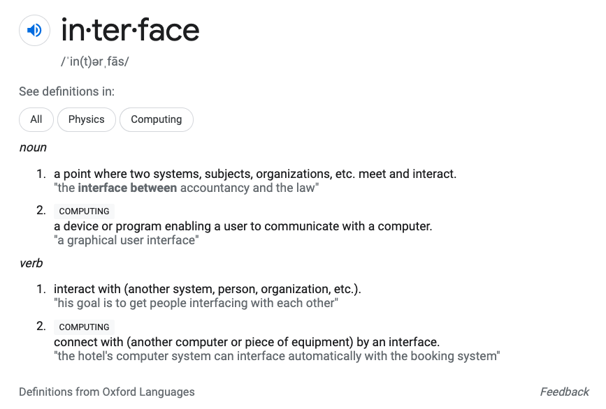
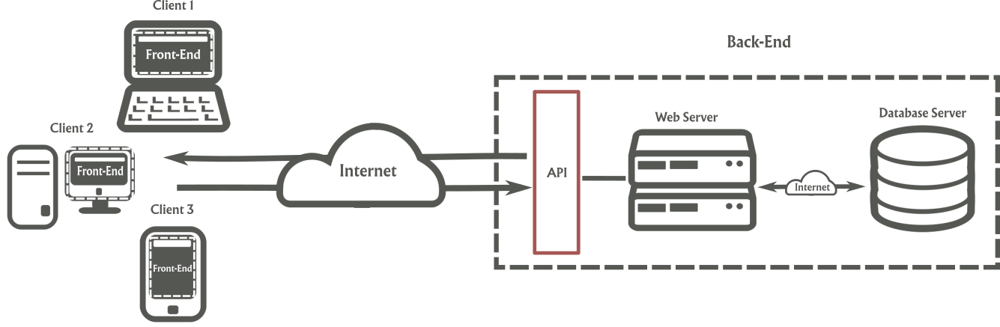

# Session 3

### Objective

Put it all together to build a REST API with Express.js

## What is an API

**A**pplication **P**rogramming **I**interface. 

Let's start with the most important part of an API, the I part, I for Interface

Interfaces are crated for two systems to interact and "talk" to each other. You might not think too much about it but you are a human system interacting with a computer system right now. You interact with the computer via a Graphical User Application (GUI) that engineers created to enable us to be communicate with and control the computer. Where a GUI connects a user and a computer and API connects two applications.

At this point we have code to retrieve and add information to our Database, but so far this functionality is only available to us the developers of this back-end. No external application can interact with our data or functionality, and data is not very useful in a silo. To expose the functionality of adding business, listing all business or updating business to external applications we will build an API in this session. This API will be accessed through HTTP on the web and any application that wants to connect to it to access its services would be able to do so.

APIs exist, so that two or more applications can communicate with each other

## Example of APIs

* [Deck of Cards API](https://deckofcardsapi.com/). An API to simulate a deck of cards. You can create decks, shuffle the deck, draw cards and add cards to piles.
* [Yelp API](https://www.yelp.com/developers/documentation/v3). Find businesses by keyword, location
* [YouTube API](https://developers.google.com/youtube/v3). Let's you search for videos, upload videos, manage playlists and subscriptions and more
* [GitHub API](https://docs.github.com/en/rest). Create repos, open/close pull requests or issues. Almost everything you can do on Github.com you can do by calling their API.
* [Dropbox API](https://www.dropbox.com/developers/documentation/http/documentation). Let's work with files in Dropbox, upload, download, search and modify files.
* [Commerce.js API](https://commercejs.com/docs/api/?shell#introduction). Back-end for an eCommerce site, so you don't have to build your own. Create, list, update and delete online store items.

## Consuming APIs

Before we can interact with APIs we need to understand their ways of communication. The previous API examples and the API we will build will communicate via HTTP messages (requests & responses) which are define by the HTTP protocol.

### HTTP

Hypertext Transfer Protocol (HTTP) is an application-layer protocol for transmitting hypermedia documents, such as HTML. It was designed for communication between web browsers and web servers, but it can also be used for other purposes. HTTP follows a classical client-server model, with a client opening a connection to make a request, then waiting until it receives a response. HTTP is a stateless protocol, meaning that the server does not keep any data (state) between two requests. [

#### HTTP Messages

HTTP messages are how data is exchanged between a server and a client. There are two types of messages: requests sent by the client to trigger an action on the server, and responses, the answer from the server.

HTTP messages are composed of textual information encoded in ASCII, and span over multiple lines. These messages are rarely crafted by hand, instead the web browser or web servers perform this action.

This is what these messages look like

##### HTTP Methods

HTTP defines various methods to be used in requests messages for the server to perform. Some are:

| Method Name | Description                                                                                                       | Our use case                                   |
| ----------- | ----------------------------------------------------------------------------------------------------------------- | ---------------------------------------------- |
| `GET`       | Requests a representation of the specified resource. Requests using GET should only retrieve data.                | Retrieving all businesses or a single business |
| `POST`      | Used to submit an entity to the specified resource, often causing a change in state or side effects on the server | Adding a new business                          |
| `DELETE`    | Used to delete the specified resource                                                                             | Deleting a business                            |
| `PUT`       | Replaces all current representations of the target resource with the request payload.                             | Fully updating/replacing a business            |
| `PATCH`     | Used to apply partial modifications to a resource.                                                                | Partially updating a business                  |

[Learn more](https://developer.mozilla.org/en-US/docs/Web/HTTP/Methods)

##### HTTP Status Codes

HTTP response status codes indicate whether a specific HTTP request has been successfully completed. Status codes are divide into 5 categories, below them I listed some of the most common per category:

* 1xx informational response – the request was received, continuing process
* 2xx successful – the request was successfully received, understood, and accepted
  * `200 OK` The request has succeeded
  * `201 Created` The requests has succedded and a new resource has been created as a result
* 3xx redirection – further action needs to be taken in order to complete the request
  * `301 Moved Permanently` The URL of the requested resource has been changed permanently. The new URL is given in the response.
* 4xx client error – the request contains bad syntax or cannot be fulfilled
  * `400 Bad Request`
  * `403 Forbidden`
  * `404 Not Found`
* 5xx server error – the server failed to fulfil an apparently valid request
  * `500 Internal Server Error` The server has encountered a situation it doesn't know how to handle.

To [learn more](https://developer.mozilla.org/en-US/docs/Web/HTTP/Status)

## Postman

## Express.js

dotenv .env

const express = require('express')
const app = express()
const PORT = process.env.PORT || '3000'

app.get('/', (req, res, next) => {
  res.send('Hello World')
})

app.listen(PORT, () => {
  console.log(`App listening on port: ${PORT}`)
})

### Resources

* [Web technology for developers > HTTP - MDN](https://developer.mozilla.org/en-US/docs/Web/HTTP)
* [The Internet Protocol Suit - Khan Academy](https://www.khanacademy.org/computing/computers-and-internet/xcae6f4a7ff015e7d:the-internet/xcae6f4a7ff015e7d:the-internet-protocol-suite/a/the-internet-protocols#main-content)
